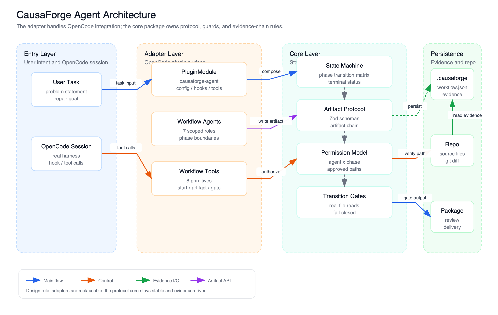
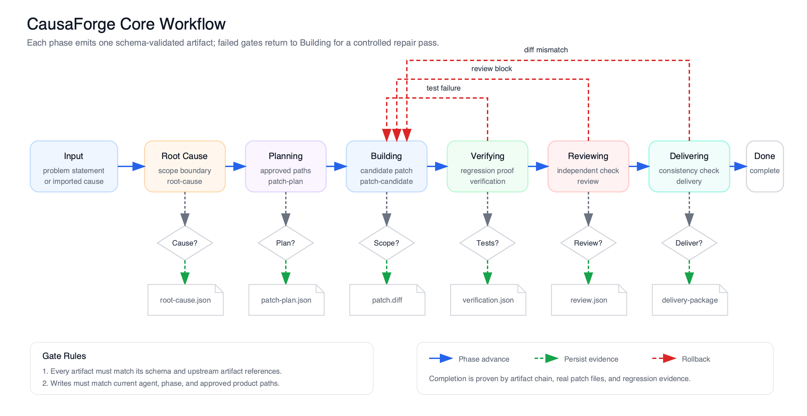
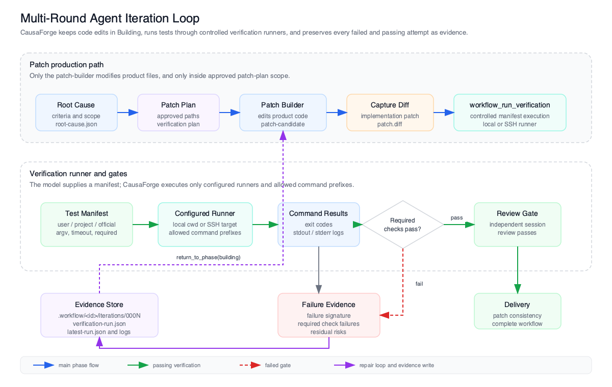

# CausaForge Agent

<p align="center">
  <strong><kbd>English</kbd></strong>
  <a href="./README.zh-CN.md"><kbd>简体中文</kbd></a>
</p>

> [!NOTE]
> **OpenCode-first, evidence-chain patch delivery.**
>
> CausaForge Agent is not a loose bundle of prompts. It is a deterministic workflow harness that turns a code change into a traceable chain of typed artifacts: root cause, patch plan, patch candidate, verification, independent review, and final delivery.

> [!TIP]
> **For agentic workers**
>
> If you are using an LLM agent, ask it to read this README and `ROADMAP.md`, run the local verification commands, then register `dist/index.js` as an OpenCode plugin before trying the workflow tools.

<div align="center">

<h1>CausaForge Agent</h1>

<p><strong>A protocol-first OpenCode plugin for auditable AI patch delivery.</strong></p>

<p>
  <a href="https://github.com/zcxGGmu/CausaForge"></a>
  <a href="./LICENSE.md"></a>
  <a href="./package.json"></a>
  <a href="./packages/causaforge-opencode/src/opencode-plugin-module.ts"></a>
  <a href="./packages/causaforge-core/src/phases.ts"></a>
</p>

<p>
  <a href="#installation">Installation</a> |
  <a href="#highlights">Highlights</a> |
  <a href="#workflow">Workflow</a> |
  <a href="#architecture">Architecture</a> |
  <a href="#development">Development</a>
</p>



</div>

---

## Why CausaForge

AI coding often fails at the handoff boundary: the model says the work is done, but the repository only contains an unverified diff and a vague explanation. CausaForge makes the handoff explicit.

The core idea is simple:

1. A workflow starts with a concrete problem or an imported root-cause artifact.
2. Each phase writes exactly one typed artifact into `.workflow/<workflowId>/`.
3. State transitions are accepted only when the required artifact chain, phase, session, scope, and patch consistency checks pass.
4. The OpenCode adapter exposes the protocol as agents, tools, and hooks while the core package stays harness-neutral.

This is built for teams that want AI agents to move fast without skipping the evidence a senior engineer would ask for.

## Installation

CausaForge is currently a source-first OpenCode plugin. Build it locally, then point OpenCode at the generated plugin entry.

### TL;DR

| You want | Run | What lands on disk |
| :--- | :--- | :--- |
| Build from source | `bun install --ignore-scripts && bun run build` | `dist/index.js`, `dist/index.d.ts`, `dist/cli.js` |
| Register in a project | add `file://<repo>/dist/index.js` to `.opencode/opencode.json` | OpenCode loads plugin id `causaforge-agent` |
| Validate before use | `bun run test && bun run typecheck && bun run build` | package tests, type safety, and build output |

### Source Setup

```bash
git clone https://github.com/zcxGGmu/CausaForge.git
cd CausaForge
bun install --ignore-scripts
bun run build
./bin/causaforge.js --version
```

### OpenCode Project Config

Create or update `.opencode/opencode.json` in the project where you want to run the workflow:

```json
{
  "plugin": ["file:///absolute/path/to/CausaForge/dist/index.js"]
}
```

For a local checkout, this helper writes a project-local config:

```bash
PLUGIN_PATH="file://$(pwd)/dist/index.js"
mkdir -p .opencode
printf '{\n  "plugin": ["%s"]\n}\n' "$PLUGIN_PATH" > .opencode/opencode.json
```

Run OpenCode after building. The plugin registers the workflow agents, workflow tools, and hooks from the compiled entrypoint.

### For LLM Agents

Paste this into an agent that has shell access to the repository:

```text
Read README.md and ROADMAP.md. Build CausaForge with `bun install --ignore-scripts` and `bun run build`. Verify with `bun run test`, `bun run typecheck`, and `bun run build`. Then register `dist/index.js` as a file:// OpenCode plugin. Use workflow_start first, record the required phase artifact before every transition, capture the implementation diff during building, and close only through workflow_complete from delivering.
```

## Skip This README

If you want an agent to explain the project instead of reading every section manually, use:

```text
Read https://raw.githubusercontent.com/zcxGGmu/CausaForge/refs/heads/main/README.md and https://raw.githubusercontent.com/zcxGGmu/CausaForge/refs/heads/main/ROADMAP.md. Explain what CausaForge enforces that a normal coding agent does not, then list the minimum commands needed to verify the local checkout.
```

## Highlights

| Surface | What it does | Source of truth |
| :--- | :--- | :--- |
| Evidence-chain workflow | Splits patch delivery into root cause, plan, implementation, verification, review, and delivery artifacts | `packages/causaforge-core/src/phases.ts` |
| Seven workflow agents | Adds one primary orchestrator plus phase-specific subagents for analysis, planning, building, verification, review, and delivery | `packages/causaforge-opencode/src/agents/registry.ts` |
| Nine workflow tools | Starts workflows, records artifacts, validates artifacts, captures diffs, runs controlled verification manifests, moves phases, rolls back phases, reports status, and completes delivery | `packages/causaforge-opencode/src/tools/index.ts` |
| Deterministic transition guard | Refuses phase changes when required artifacts, references, verification, review, sessions, or patch consistency are missing | `packages/causaforge-core/src/guards/transition-guard.ts` |
| Scope-limited write guard | Allows product writes only from the building phase and only to paths approved by the patch plan | `packages/causaforge-opencode/src/hooks/tool-permission.ts` |
| Independent review gate | Requires the reviewer session to differ from the builder session before review begins | `packages/causaforge-core/src/guards/session-guard.ts` |
| Harness-neutral core | Keeps schemas, state transitions, permissions, artifact paths, and guards independent from OpenCode runtime details | `packages/causaforge-core/` |
| OpenCode adapter | Maps the core protocol into OpenCode agents, tools, config hooks, tool-permission hooks, stop gates, and compaction state | `packages/causaforge-opencode/` |

## Workflow



SVG source: [`docs/diagrams/causaforge-workflow.svg`](./docs/diagrams/causaforge-workflow.svg)

| Phase | Owner | Required artifact | Gate before next phase |
| :--- | :--- | :--- | :--- |
| `intake` | `workflow-orchestrator` | optional imported root cause | start from problem description or imported root cause |
| `root_cause` | `root-cause-analyst` | `root-cause.json` | confirmed root cause exists |
| `planning` | `patch-planner` | `patch-plan.json` | plan references the active root cause |
| `building` | `patch-builder` | `patch-candidate.json` and captured patch | candidate references the plan and stays inside approved paths |
| `verifying` | `regression-verifier` | `verification.json` | verification passes every root-cause criterion |
| `reviewing` | `patch-reviewer` | `review.json` | independent review passes |
| `delivering` | `delivery-coordinator` | `delivery-package.json` | delivery references the full artifact chain and patch content matches |
| `completed` | protocol state | complete artifact chain | workflow is closed |
| `blocked` | protocol state | current evidence | workflow is intentionally stopped |

### Multi-Round Agent Iteration



SVG source: [`docs/diagrams/causaforge-iterative-agent-loop.svg`](./docs/diagrams/causaforge-iterative-agent-loop.svg)

The repair loop is intentionally narrow: only `patch-builder` edits product files, `workflow_run_verification` executes configured local or SSH runners, and every failed or passing run is preserved under `.workflow/<workflowId>/iterations/<000N>/`. A failed required check records failure evidence and returns the workflow to `building`; only a passing verification can advance to independent review.

## Agent Roster

| Agent id | Mode | Responsibility |
| :--- | :--- | :--- |
| `workflow-orchestrator` | primary | Owns intake, coordination, handoffs, and final user-facing status |
| `root-cause-analyst` | subagent | Investigates the problem and records the confirmed root cause |
| `patch-planner` | subagent | Converts the root cause into a minimal approved file-change plan |
| `patch-builder` | subagent | Implements only approved product paths and records the patch candidate |
| `regression-verifier` | subagent | Runs controlled verification manifests and records command evidence against root-cause criteria |
| `patch-reviewer` | subagent | Reviews patch scope, verification sufficiency, and blocking risks independently |
| `delivery-coordinator` | subagent | Packages the final delivery artifact and handoff summary |

## Tool Surface

| Tool | Purpose |
| :--- | :--- |
| `workflow_start` | Create workflow state from a problem description or imported root cause |
| `workflow_status` | Report phase, status, and missing artifacts |
| `workflow_record_artifact` | Persist a phase artifact and its Markdown rendering when available |
| `workflow_validate_artifact` | Validate an artifact against its Zod schema |
| `workflow_capture_diff` | Capture the current Git diff as the implementation patch |
| `workflow_run_verification` | Run a controlled local or SSH verification manifest and preserve per-iteration logs |
| `workflow_transition` | Evaluate transition gates and persist the next phase |
| `workflow_return_to_phase` | Move back to an earlier phase when a gate or review requires rework |
| `workflow_complete` | Close the workflow from `delivering` to `completed` |

## Architecture


SVG source: [`docs/diagrams/causaforge-architecture.svg`](./docs/diagrams/causaforge-architecture.svg)

```text
packages/causaforge-core/
  Harness-neutral workflow phases, schemas, artifact store, permissions, and guards.

packages/causaforge-opencode/
  OpenCode plugin module, agent registry, workflow tools, lifecycle hooks, and config parser.

.workflow/<workflowId>/
  Runtime workflow state and artifacts written by the plugin inside the target project.
```

The split matters: core owns facts and gates; the OpenCode adapter only maps those facts into a runtime surface.

## Configuration

The OpenCode adapter currently parses these config fields:

| Field | Default | Current behavior |
| :--- | :--- | :--- |
| `artifact_dir` | `.workflow` | Parsed by adapter config; current core artifact root is fixed at `.workflow` |
| `require_independent_review` | `true` | Parsed as policy surface; the current transition guard enforces independent review unconditionally |
| `require_clean_worktree` | `true` | Parsed as policy surface; current write gates are path and phase based |
| `allow_plan_deviation` | `false` | Passed into the transition guard for approved-path scope checking |
| `auto_continue_after_compaction` | `true` | Parsed as policy surface; compaction state hooks are exposed by the adapter |
| `agents` | `{}` | Optional per-agent model, variant, and reasoning-effort overrides |
| `verification` | local runner, max 5 iterations | Configures controlled local/SSH verification runners, allowed command prefixes, and iteration caps |

## Development

```bash
bun install --ignore-scripts
bun run test
bun run typecheck
bun run build
git diff --check
```

The root package exports the OpenCode adapter entrypoint and bundles `packages/causaforge-opencode/src/index.ts` into `dist/index.js`.

## Project Layout

```text
packages/causaforge-core/       State machine, artifact protocol, schemas, permissions, guards
packages/causaforge-opencode/   OpenCode adapter, agents, tools, hooks, config
docs/diagrams/                  README architecture and workflow diagrams
script/build.ts                 Bun build script for the plugin entrypoint
bin/causaforge.js               CLI wrapper for local build metadata
tasks/                          Execution plans, reviews, and lessons
refactor/                       Design notes for workflow layering
```

## Roadmap

Current direction is tracked in [`ROADMAP.md`](./ROADMAP.md):

- Keep CausaForge focused on an auditable OpenCode-first patch workflow.
- Preserve the split between harness-neutral core and runtime adapters.
- Add stronger OpenCode harness automation.
- Expand evidence rendering into review-ready Markdown summaries.
- Add future adapters as independent packages instead of compatibility aliases.

## What CausaForge Is Not

- It is not a general chat-agent bundle.
- It is not a replacement for tests, typechecks, or code review.
- It does not document a public package-manager installer flow in this README.
- It is not a multi-harness runtime yet; the current production adapter is OpenCode.

## License

CausaForge Agent is released under [`SUL-1.0`](./LICENSE.md).
